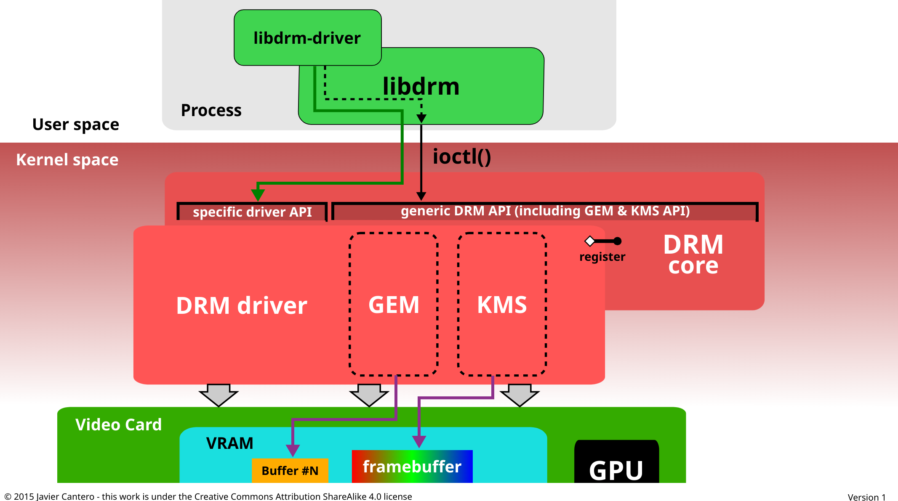
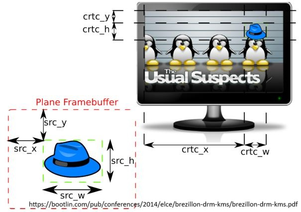
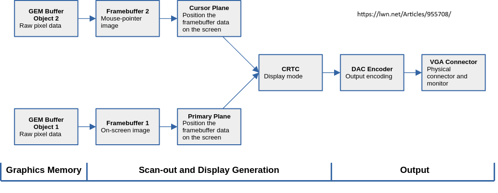

# Linux Kernel Display and Graphics

## Frame Buffer Device (fbdev)

### Concept

When in the old days, display devices and graphics devices were simple and had no 3D or any modern functionality, the user interface was only a virtual text console on the screen with basic pixels operations, the graphics stack is as simple as a frame buffer to the display device and varies operations on the buffer. Thus Linux fbdev subsystem was provided as a hardware-independent layer to user space applications that will operate on the display output, and hardware vendors may provide their own fbdev drivers for hardware specific settings.

The fbdev subsystem provides user space interfaces for the frame buffer devices as `/dev/fbX` where X starts from 0 and increases 1 for each display devices. It's exposed as a char device so the user space application can read, write and ioctl on it. The usage of this char device is available in `linux/fb.h`. Normally the most possible user space application to use fbdev file directly is the X server. The fbdev will be exclusive when it's controlled by one application. See the very old document [The Frame Buffer Device](https://www.kernel.org/doc/html/latest/fb/framebuffer.html) for more details of the frame buffer.

For Linux virtual terminal (VT), frame buffer console driver (fbcon, `CONFIG_FB_CONSOLE`) provides the console support on frame buffer devices. When the display server is not started properly or the user explicitly enters the Linux VT by `Ctrl+Alt+Fx`, the display normally will show a text console output on one of the `/dev/ttyX` of Linux, the graphic console color, font and resolution is controlled by fbcon. See [this link](https://www.kernel.org/doc/html/latest/fb/fbcon.html) for more information about the frame buffer console.

### Usage

The fbdev subsystem should be considered legacy, in a typical desktop machine, almost the only use cases for fbdev are to provide fbcon with Linux virtual terminal and provide boot splash screens.

Unless for some low end embedded systems, the fbdev subsystem and drivers are replaced by the modern DRM subsystem and drivers. In kernel configuration, `CONFIG_FB` is for the fbdev subsystem and there's a `CONFIG_DRM_FBDEV_EMULATION` config for providing fbdev support in DRM, modern hardware DRM drivers provides the legacy fbdev support within, like Intel i915 driver the fbdev support is in `drivers/drm/i915/display/intel_fbdev.c`.

## Direct Rendering Manager (DRM) Overview

### History

Before DRM subsystem was introduced, fbdev was used for managing video cards or graphics accelerators with basic frame buffer operations without the 3D accelerating hardware support. The early PC games mainly runs on CPU with floating point operations, the frames are sent to video adapters just for display. In the late 90's more and more hardware accelerators were introduced and integrated to take some responsibility of the 3D operations, to free CPU from this dedicated tasks. These devices became more and more complex in the late 90's, the term GPU to mean Graphics Processor Unit was used by Nvidia for their GeForce 256, the first single-chip graphics processor with a T&L engine (Transform and Lighting) in 1999. Since then the "modern" GPU form was established, and GPU became the dedicated hardware for graphics, no matter it's discrete or integrated.

To meet the requirements of the progress of the GPU hardware evolution, the first DRM driver for 3dfx video cards was developed in 1999 and merged into Linux mainline. Later DRM supported a few other video cards, and over the years DRM subsystem grew and changed in functionality and supported GPUs until now. For the DRM history, the Wikipedia DRM page has a history section for the interested readers: [DRM History](https://en.wikipedia.org/wiki/Direct_Rendering_Manager#History).

### Design

The DRM subsystem consists of two major parts: DRM core and DRM drivers. The DRM core contains the DRM framework code and APIs to be used by DRM drivers, which each hardware vendor implements for its own product and uses the generic DRM core parts for APIs of memory management, mode-setting and other components like the memory sharing and GPU switching etc. The DRM core provides user space interface via device file ioctls, and has internal interface for fbdev compatibility layer for fbcon. Internally, the two major components GEM and KMS require the DRM driver to register to the DRM core and provides the implementations to meet the APIs. The vendor specific DRM driver will talk with the GPU hardware to manage it.

The following diagram is for the Linux kernel DRM subsystem (Direct Rendering Manager) from [wikipedia DRM page](https://en.wikipedia.org/wiki/Direct_Rendering_Manager). More details will be summarized in later sections.

## User Space Interface

DRM subsystem is part of the Linux kernel and runs in the kernel space, so it's natural for it to provide user space access to its functionality by some method for X Server, Wayland or others. DRM devices are provided as device files at `/dev/dri/`. There are two types of device nodes are used today:

- **Primary node**: `/dev/dri/card*`. The primary node serves as the main GPU access for mainly ioctl controls to manage the GPU for mode setting and other privileged operations by a **DRM-master**. The DRM-master concept is that it's the only user space application to have access to a DRM primary node to do mode setting and privileged operations at a given time. For example it's normally X Server or Wayland compositor to open the DRM primary node and set itself as DRM-master to have exclusive access to the GPU, so no other user space applications can control the GPU to do mode setting. DRM-master can authenticate other user space applications to have some privileged controls on the GPU. See the KMS section for the transition from user space mode setting to kernel mode setting, the DRM-master concept plays a role in this. For a normal desktop Linux machine, DRM-master is acquired by X Server or Wayland when it boots, and can be dropped when the user switches to another Linux VT.
- **Render node**: `/dev/dri/renderD*`. The render node comes with the primary node of the same DRM device with the number starting from 128, if the driver supports a separate render node. The render node is introduced because that the GPUs increasingly are used for offscreen rendering (for example headless server) and GPGPU applications. Under these conditions, the system doesn't need a display server like X Server or Wayland running, and doesn't need to do mode setting at all since there's no display. But the primary node is for exclusive use of DRM-master, the other unprivileged user space applications can only get authenticated from the DRM-master to use the GPU. To solve this, render node is introduced and all user space applications can access it with only the normal file access attribute control, and render node accepts the DRM ioctl APIs marked as `DRM_RENDER_ALLOW`. So DRM-master is irrelevant when all random user space applications can do GPGPU tasks with render node.

There is a library `libdrm` which is a simple wrapper around the DRM ioctl APIs to be used by user space applications that need to access the DRM device.

The summary here is an over-simplified version of the DRM user space interface, the kernel document for details about this is at [Userland interfaces](https://www.kernel.org/doc/html/latest/gpu/drm-uapi.html).

## Memory Management: GEM and TTM

As the GPU and the graphics API such as OpenGL grows more and more complex, and the requirements for off-screen rendering and GPGPU, several methods for Linux DRM were developed for better managing memory buffers. Two memory management design were merged into Linux mainline.

First one is **Graphics Execution Manager (GEM)**. It was developed by Intel Linux developers for the Intel i915 driver. GEM allows the user space application to create, manage and delete memory buffers in the video memory called GEM objects. The GEM objects live in kernel DRM GEM, the GEM API is used by applications to manage these memory buffers with a handle bound to each. GEM is responsible to allocate the memory objects and free them when the application releases them intendedly or accidentally because of crash or being terminated. GEM doesn't consider on-board video memory, so make it UMA only since the i915 was for Intel integrated GPUs. GEM was designed not only for memory management, but the other APIs like controlling the execution command buffers were Intel specific and not used by other vendors' DRM drivers.

At about the same time but merged later into mainline was another memory management method called **Translation Table Manager (TTM)**, it was developed for ATI Radeon DRM driver initially. By the design it considered multiple types of memory that the GPU can use, like the video RAM on the GPU PCIe card and system memory accessible via IOMMU. It tried to support all kinds of memory types and manage the concurrent accesses from CPU and GPU with consistency. Thus it is complex and hard for driver implementation.

Because the TTM design is considered more suitable for discrete GPU with its own video memory, some DRM drivers prefer to implement TTM internally. And because the TTM API complexity and most GPUs do not need all the APIs, GEM API as a far simpler alternative is considered a better choice. So these DRM driver implements TTM internally and expose memory as GEM objects then provide GEM API to user space. The radeon and nouveau drivers are examples of such a combination.

The Linux kernel document for DRM memory management is at [DRM Memory Management](https://www.kernel.org/doc/html/latest/gpu/drm-mm.html).

For readers interested in the history about TTM and GEM, this article is an interesting read: [The Linux graphics stack from X to Wayland](https://arstechnica.com/information-technology/2011/03/the-linux-graphics-stack-from-x-to-wayland/).

## Kernel Mode Setting (KMS)

### Mode Setting

A display has many attributes to work properly, the screen resolution, color depth, refresh rate. The combination of these attributes allowed by the underlying display hardware is called a mode, so setting the display mode to a correct combination of these attributes is called mode-setting. The display hardware is on the GPU, so mode setting needs to operate on the GPU hardware to configure these attributes.

### User-space Mode Setting to Kernel Mode Setting

In the early days of Linux graphics, the display mode setting was done by user space applications like X Server as other display/graphics were all handled by X Server alone. The approach is referred as user space mode setting (UMS). But this approach has several issues:

- The user space applications are possible to do mode-setting at the same time, two or more applications may try to set the display at the same time and cause misconfiguration and issues. Then it was a common practice that the X Server became the only application for UMS. But other alternatives to X will have to include the same functionality in their code.
- During system boot, the kernel needs to set the text mode for the virtual console as it cannot rely on an user space application to set it up if it exists at all. So when X Server starts later it needs to handle the state transition. Flicker will occur during the process and when switching between X and Linux virtual console or other X instances.
- The security issues and more...

So KMS is introduced to address these issues. The mode-setting functionality is included in the DRM subsystem and the KMS APIs are provided, so it is not duplicated in fbdev, X Server and any other user-space applications anymore. It also makes it possible for user-space applications to do mode-setting using some resources that normally only available in kernel space like interrupts, and simplified a lot for sleep/resume process which is naturally more suitable to be done in kernel space.

### KMS Components

A display, given different hardware implementations and generations, can be abstracted as a device that whose main functionality is to display the frames and refresh the outputs in fixed or dynamic rates to the users. In all the aspects of the frame color, resolutions, refresh rates, output physical connections and other additional functionalities, there are some common components can be abstracted from a software driver perspective. Thus the KMS model has these abstract blocks to define the different components and to fit the display pipeline to the model:

- **Framebuffer**: `struct drm_framebuffer` is an abstract of the buffer objects of the frames to be displayed. It contains not only the raw frame data but also the metadata of the frame: color format, size and other information like padding etc. The framebuffer needs not to match the display resolution, the buffer size may be larger or smaller, to cover only part of the final display output, or the final display output only uses part of the framebuffer.

- **Plane**: a plane `struct drm_plane` is not a direct hardware abstraction but a software concept, it gets the input from a framebuffer and is fed to CRTC. The plane gets the input data from a framebuffer and specifies the position in the original framebuffer, scaling factor, rotation etc., and then also specifies the position in the scanout buffer. The relationship is shown in figure below.

  

- **CRTC**: `struct drm_crtc` performs the scanout process in the display pipeline. It gets inputs from one or multiple planes and blend them together. One CRTC must have one plane bound called the primary plane, and can have other planes to bind such as one dedicated plane for the cursor and other hardware specific overlay planes. The CRTC fetches all the data from one or multiple planes and overlays the pixels, to generate a final display frame. The CRTC controls the hardware mode settings. Also there can be multiple CRTCs when there are multiple display outputs.

- **Encoder**: `struct drm_encoder` is the connecting hardware abstract between CRTC and the connector, it gets the pixel data from CRTC and converts it to a format suitable for the connector hardware. For example the connector interfaces may accept analog outputs such as VGA; others may take digital signals such modern DisplayPort and HDMI. A connector only accepts limited ranges of encoding and at a given time it can only connect to one encoder. Not all encoders can be connected to a specific CRTC because of hardware limitation from the hardware that the CRTC abstracts. So the data process combination of CRTC-encoder-connector is limited by hardware.

- **Connector**: `struct drm_connector` is a hardware abstraction of the hardware display connectors, such as DisplayPort, HDMI, DVI, VGA etc. It configures the connector hardware to deliver the signals and pass the frame data.

The below graph shows an overall scanout process in the Linux KMS model:

### Links

- The [Linux kernel document for KMS](https://www.kernel.org/doc/html/latest/gpu/drm-kms.html) has a few concept explanations but mostly directly jumps to the source code APIs.
- This slide provides clear explanation for the whole KMS pipeline and some details: [The DRM/KMS subsystem from a newbie's point of view](https://bootlin.com/pub/conferences/2014/elce/brezillon-drm-kms/brezillon-drm-kms.pdf).

## Further Reading

- Why Linux doesn't move GUI to kernel space. Check the first two high-voted answers, though the question is about Linux, these answers talk about Windows much more. However, they are still informative: [https://www.zhihu.com/question/20667741](https://www.zhihu.com/question/20667741).
