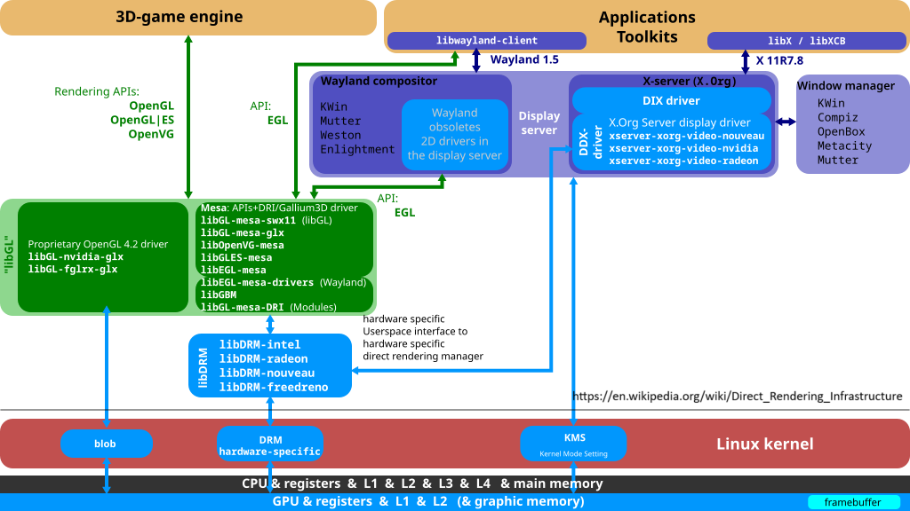
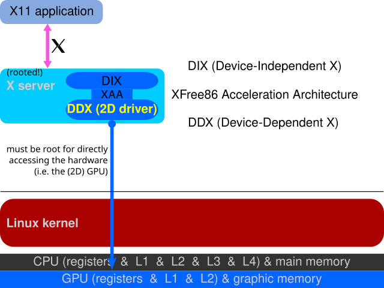
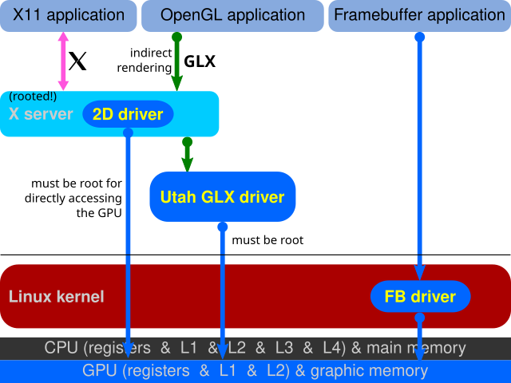
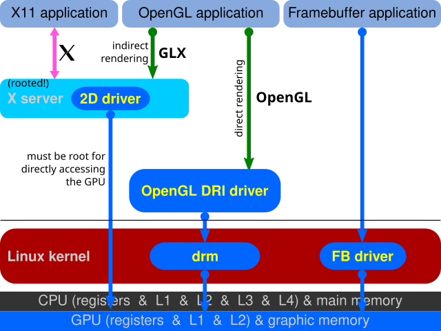
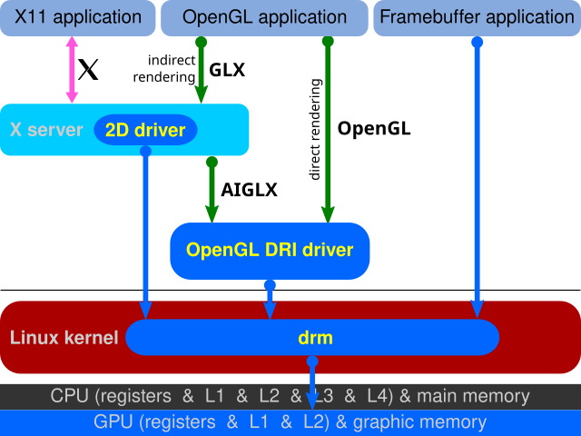
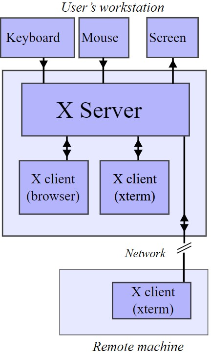
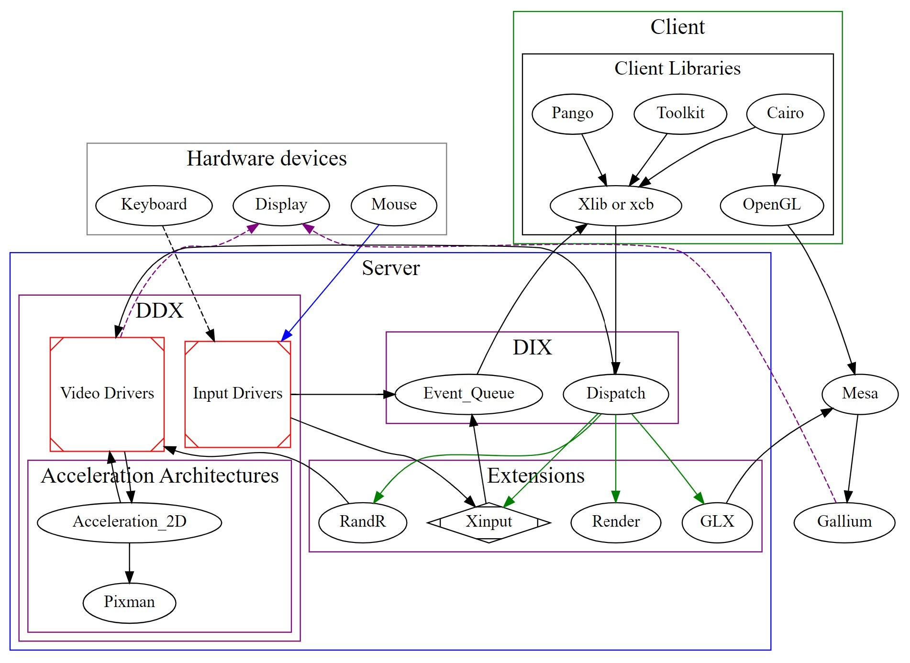
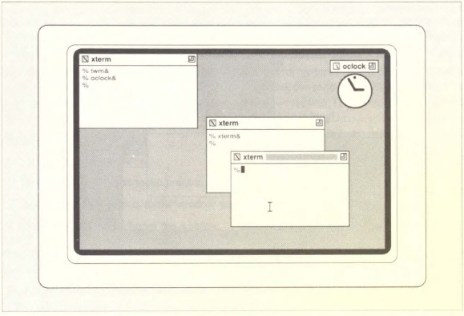
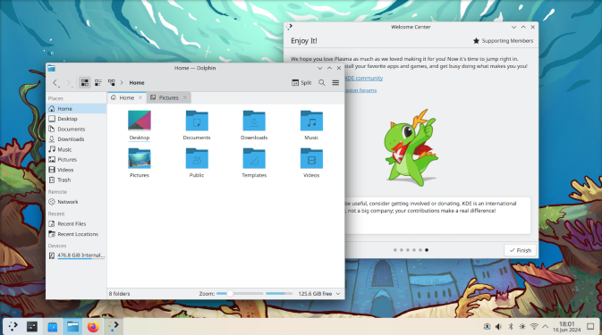

# User Space Parts of the Linux Graphics Stack

## Overview of User Space Graphics Stack

There is another Linux graphics stack overview graph with more details of the libraries and window managers. In this section the user space parts of the Linux graphics stack will be focused:

- Display Server: X Server and Wayland compositor, the legacy and new display servers in the Linux desktop environment. They are the core of the graphics stack in the user space.
- Mesa: the open source 3D accelerating library.
- Desktop Environment: the integrated desktop GUI experience on top of the Display Server.
- GUI applications.



### Direct Rendering Infrastructure (DRI)

DRI are an open source framework to transfer the Linux graphics stack from the old architecture to the new 3D accelerated, direct rendering architecture:

- Old architecture: X Server supported only 2D in its DDX drivers for each vendor's GPU and was the only process to access the GPU to do rendering, all X clients communicated with X Server to "indirect rendering". X Server run in root privilege and control everything about GPU.
- Target: to support the 3D OpenGL accelerating functionality of GPU; X Server GLX extension for X clients to "indirect rendering" (for example X clients connected via network); let GPU application be possible to "direct rendering" OpenGL operations to the GPU with DRI driver to avoid overhead of IPC between X Server and X clients; Linux kernel new Direct Rendering Manager (DRM) subsystem to manage the GPU and provide the foundation of direct rendering.

It started in 1998 and had 3 major versions, though with the transfer from X Window System to Wayland the DRI code changes in X Server and GLX extension itself become irrelevant, the DRI concept of direct rendering is the base of the modern Linux graphics stack and all other contributions are used today.

The above overview graph and the following change history are all from the [DRI wikipedia page](https://en.wikipedia.org/wiki/Direct_Rendering_Infrastructure). The following series of graphs are wonderful to show the evolution of the Linux graphics stack:

1. 2D drivers inside of the X server



2. Indirect rendering over GLX, using Utah GLX; separate: fbdev



3. Early DRI: Mode setting is still being performed by the X display server, which forces it to be run as root



4. Finally all access goes through the Direct Rendering Manager



5. In Linux kernel 3.12 *render nodes* were introduced; DRM and the KMS driver were split. Wayland implements direct rendering over EGL


## X Window System: Legacy and History of 40 Years

### History

X Window System (X11, or X) is the most common windowing system for GUI on UNIX-like operating systems for many years. X started from MIT since 1984, and at 1987 it reached version 11, and the major version has never changed since then, so it is often referred as X11.

X itself is a protocol, not a piece of software. Many implementation existed. Originated in 1992, XFree86 from X386 gradually became the most popular X implementation. The development model and license issue began to emerge even though the XFree86 was the most widely used X with the Linux gained its popularity around the year 2000. Long story short, X.Org (found at 1999) became X.Org Foundation at 2004, started from a XFree86 fork and took over X development with releasing of X11R6.7 X.Org Server. The official reference implementation X.Org Server then entered most Linux distributions and lasted until now. The interested readers may find these links to be entertaining:

- [X's history](https://en.wikipedia.org/wiki/X_Window_System#History)
- [X Window System at 40](https://blog.dshr.org/2024/07/x-window-system-at-40.html)
- [Graphical desktop system X Window just turned 38](https://www.theregister.com/2022/06/22/the_x_window_system_just)

The last full release of X.Org was X11R7.7 at 2012. After this release each individual module of X.Org Server released as needed, but it is highly unlikely a new X11R6.8 version to be released: the lead maintainer left, no major features were been developed but often just security fixes, the X.Org is maintained by freedesktop.org who is developing Wayland that is targeting to replace X, the more and more Linux distributions are moving to Wayland by default. However, X still hangs around in Linux systems and many old or propriety softwares refuse to switch to Wayland. This situation may not change very soon, X and Wayland may still co-exist for a few years to come.

### Architecture



X Window System architecture has following characteristics:

X works in a client-server model. The X server controls the graphical output to display and the input devices like the keyboard, mouse, touchpad etc. An X server communicates with multiple clients, the clients can be any GUI programs.

X is designed with remote capability natively. It came from the centralized server and thin clients age, so was designed with remote networked clients in mind. The X client applications can be in the same machine, or running in a remote machine, X server can render the application window outputs to the local display with no difference.

X defines the protocol between server and client, but it doesn't define any specification of the look and feel of the client applications. The GUI widget, the theme and style are independent from X server.

There's one catch of the X server and client relationship: the X server that outputs to monitor and get user inputs are in front of the end user, while the X client may run in a remote machine, and the user keyboard/mouse input are connected to the server directly. This is in contrast with the web server-client model that the users are used to think the web applications in the browser we are typing in and getting output are clients, and the remote function part without display/input are the servers.

Further reading:

- [Iconography of the X Window System: The Boot Stipple](https://matttproud.com/blog/posts/x-window-system-boot-stipple.html)

### Programming

Given the current status of the X.Org Server and trends of the Linux distributions, it is unlikely the new developers will join the X.Org Server development. Even when it was dominating the GUI of Linux, most developers will use higher level toolkits like GTK+ and Qt to develop GUI applications on Linux, instead of directly working on X level. There are XCB (X C Bindings) and Xlib (libX11) if developing on X directly is necessary.

The [Wikipedia page of X.Org Server](https://en.wikipedia.org/wiki/X.Org_Server) is a good starting point for technical details of the X.

In the x.org website, there's an interesting guide [The X New Developer’s Guide](https://x.org/wiki/guide/). Let's finish the X section with a detailed X architecture from this guide, the reader may find this diagram and the guide useful when one day in some consequences working with X is necessary:



Some components in the graph:

- **DIX**: Device Independent X. The core and hardware independent part of the X.Org Server.
- **DDX**: Device Dependent X. The hardware dependent part of the X.Org Server. The packages `xserver-xorg-video-xxx` in Debian/Ubuntu packaging system are DDX for each vendor's GPU.
- **GLX**: Open**GL** Extension to the **X** Window System. GLX is an X extension of interface of OpenGL and X Window System.

### Tips for Users

```shell
# Check the X server is running or not
ps aux | grep Xorg

# Start X server in Linux Virtual Terminal (in rare cases)
startx

# find the X server configuration.
ls /etc/X11/

# The main Xorg configuration file is /etc/X11/xorg.conf (/etc/X11/xorg.conf.d/*), but nowadays Xorg can work well without it. NVIDIA proprietary driver may ask the user whether to create a X config file, it will create a /etc/X11/xorg.conf with correct NVIDIA GPU driver setting.

# Check *DISPLAY* environment variable, X client application (GUI app) will use this environment variable to find the right Xorg server. For example, it's normally ":0" and the user can check the port number is 0 from `ps aux | grep Xorg`. A ssh session won't set *DISPLAY*, and if the user unsets *DISPLAY* in current shell, GUI application cannot start.
echo $DISPLAY
```

## Wayland: A Linux Graphics "Future" Since 10 Years Ago

### History and Advantages to X

"Wayland is a replacement for the X11 window system protocol and architecture with the aim to be easier to develop, extend, and maintain." -- [wayland.freedesktop.org](https://wayland.freedesktop.org)

As the description from Wayland's official site, Wayland was created by some developers to replace X Window System, because X lasted too long and the design and security issues became more and more a problem for contemporary hardware and software. At the early phase the Wayland development was mainly backed by Intel and Red Hat. Wayland, as newly developed from scratch, has some major differences and advantages comparing X:

- Wayland follows the server-client architecture of X Window System, but drops the networking support between server and client. So the server-client of Wayland always are in the same machine. Wayland server is called "compositor".
- Wayland compositor doesn't have a single implementation, instead it asks the desktop environment has its own compositor implementation. There's an reference compositor called Weston; KDE has Kwin; GNOME has GNOME Shell (mutter).
- Window Manager isn't standalone, it's inside the compositor. Wayland compositor does multiple functionalities  comparing to X.
- Wayland has a simpler and modern architecture than X, it doesn't need to follow the separate components design and some legacy hardware/feature support of X. The code base difference is huge.
- Wayland is designed to provide better modern features of the current hardware of GPU, monitor, input devices, like the Hi-DPI display, multi-touch screen.
- Wayland learns the security lessons from X and can make better choices when in design instead like X to patch over the years.

The following link is an old but informative article for the X to Wayland history and technology rationales:

-  [The Linux graphics stack from X to Wayland](https://arstechnica.com/information-technology/2011/03/the-linux-graphics-stack-from-x-to-wayland/)

### Architecture

The Wayland architecture is described in the following diagram and steps in [Wayland Architecture](https://wayland.freedesktop.org/architecture.html):


1. The kernel gets an event and sends it to the compositor. This is similar to the X case, which is great, since we get to reuse all the input drivers in the kernel.
2. The compositor looks through its scenegraph to determine which window should receive the event. The scenegraph corresponds to what's on screen and the compositor understands the transformations that it may have applied to the elements in the scenegraph. Thus, the compositor can pick the right window and transform the screen coordinates to window-local coordinates, by applying the inverse transformations. The types of transformation that can be applied to a window is only restricted to what the compositor can do, as long as it can compute the inverse transformation for the input events.
3. As in the X case, when the client receives the event, it updates the UI in response. But in the wayland case, the rendering happens in the client, and the client just sends a request to the compositor to indicate the region that was updated.
4. The compositor collects damage requests from its clients and then recomposites the screen. The compositor can then directly issue an ioctl to schedule a pageflip with KMS.

In Wayland architecture the client is responsible for rendering the application output in the buffer. The compositor only takes the multiple buffers from different clients and composites the final desktop output to the display. The Wayland clients and server use the Linux kernel DRI interface to get and share the buffer, so there are no extra buffer copying for compositor to use client buffers to composite.

The Wayland is not only an abstract protocol specification but also has a library implementation for the protocol. Its source code can be found in [freedesktop Gitlab](https://wayland.freedesktop.org/architecture.html). It provides two client libraries `libwayland-client` and `libwayland-cursor` and one server library `libwayland-server`. The user can find they are dynamically linked when an GUI application is running under Wayland desktop environment, however the application itself won't link it but the underlying GUI libraries will link them, like Qt or GTK.

### Programming

Wayland has some good resources for learning the concepts and the details. Some compositors' development is relatively active and provides useful information too.

- [https://wayland.freedesktop.org/docs/html/](https://wayland.freedesktop.org/docs/html/)

- [https://wayland-book.com/introduction.html](https://wayland-book.com/introduction.html)
- [https://swaywm.org/](https://swaywm.org/)

### Compatibility to X Window System and Applications

Though in previous sections the advantages of Wayland over X are demonstrated and the Linux desktop community is moving to Wayland in the last ten years, it's still far from a Linux world without X existence. There are still some reasons for X and Wayland to co-exist for a while:

- Legacy applications may not be updated to use Wayland. They may depends on old versions of GUI libraries that only run on X.
- Some GPU hardware vendor lacks interests to provide better Wayland support in their software. So a distribution default to Wayland may still fall back to X backend when it's running on some vendor's GPU.
- Wayland doesn't develop fast and some features didn't come mature as X for some time. Linux desktop is almost purely community driven and that also means short of resources.

So considering this, Wayland also has a `Xwayland` component to provide compatibility to X applications. `Xwayland` runs as a Wayland client for Wayland compositor, and runs as a X server for these X applications. By this even the applications still talk in X language can still work in a Wayland desktop. Following is a typical KDE Wayland desktop with Xwayland running to support some X11 applications ([This link](https://community.kde.org/KWin/Wayland) provides some more information for KDE kwin to add Wayland support from the previous X11 only base.):

```shell
# ps aux | grep kwin
... /usr/bin/kwin_wayland_wrapper --xwayland
... /usr/bin/kwin_wayland --wayland-fd 7 --socket wayland-0 --xwayland-fd 8 --xwayland-fd 9 --xwayland-display :1 --xwayland-xauthority /run/user/1000/xauth_QDMGne --xwayland

# printenv | grep DISPLAY
DISPLAY=:1
WAYLAND_DISPLAY=wayland-0
```

## Mesa

Mesa project started as a spare time project of implementation of the OpenGL API. It was one of the early implementation of OpenGL and became a major open source project on Linux for the OpenGL and the graphics software in the following years. The Mesa project also implemented more graphics and related APIs like OpenGL ES, Vulkan, VA-API, OpenCL. Mesa is an important part of the 3D graphics stack on the Linux together with other open source projects as X.Org Server, DRI, Wayland etc.

Mesa includes the vendor drivers for different vendors' different generations of GPU, they are included in the zmesa package. For example of Intel integrated GPU, these current and legacy Mesa drivers are for different generations of Intel integrated GPU:

- Mesa
  - i915g: for Intel Gen 3 GPU
  - crocus: for Intel Gen 4-7 GPU
  - iris: for Intel Gen 8 and later GPU
- Mesa amber branch (legacy non-[Gallium3D](https://docs.mesa3d.org/gallium/index.html) drivers, only bug fixes)
  - i830: for Intel Gen 2 GPU, same binary as i965
  - i915: for Intel Gen 3 GPU, same binary as i965
  - i965: for Intel Gen 4-11 GPU

Not every vendor likes to support open source. Among other major GPU vendors, AMD supports some Mesa drivers for some of its products, and also has proprietary drivers too; Nvidia is famous to not like open source and provides its own proprietary OpenGL implementation, the community-driven nouveau driver is reverse engineering without much support from Nvidia.

Mesa is a huge project and deeply connected with graphics APIs like OpenCL/Vulkan. Here is only a quick introduction as in previous sections the name is mentioned in many places. For interested readers, the [Wikipedia page for Mesa](https://en.wikipedia.org/wiki/Mesa_(computer_graphics)) and [Mesa documentation](https://docs.mesa3d.org/index.html) is good starting points.

## Desktop Environment

The desktop environment (DE) is the overall graphical user interface of the whole system, it consists of the window styles, icons, widgets, desktop bars and many applications to form an unified environment to the end user. Linux desktop is built on open source software and because of the open source nature, there are many choices instead of the case of proprietary OS like Windows/macOS. The mostly used DE on Linux are [KDE](https://kde.org/), [GNOME](https://www.gnome.org/).

 For example, the twm window manager screenshot from 1990 book "X Window System User's Guide for X11 R3 and R4 of the X Window System" and a 2024 KDE differ greatly, but they both talk in X11, despite the revision changes from R4 to R7. And the 2024 KDE plasma 6 mainly works under Wayland. Also the Ubuntu's default GNOME customized desktop may be more well known to average developers.





This topic will not be covered in details here, however there are some interesting links for the history and alternative choices to pick if the reader finds his/her daily Ubuntu desktop boring:

- [Top Linux Desktop Environments That Will Make Your Linux Great Again](https://medium.com/@TechnologyMoment/top-linux-desktop-environments-that-will-make-your-linux-great-again-83cb322d2cf1)
- [How the Linux desktop has grown](https://opensource.com/article/19/8/how-linux-desktop-grown)
- [Desktop environment](https://en.wikipedia.org/wiki/Desktop_environment)
